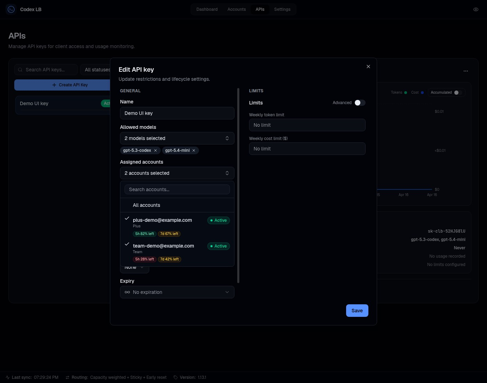
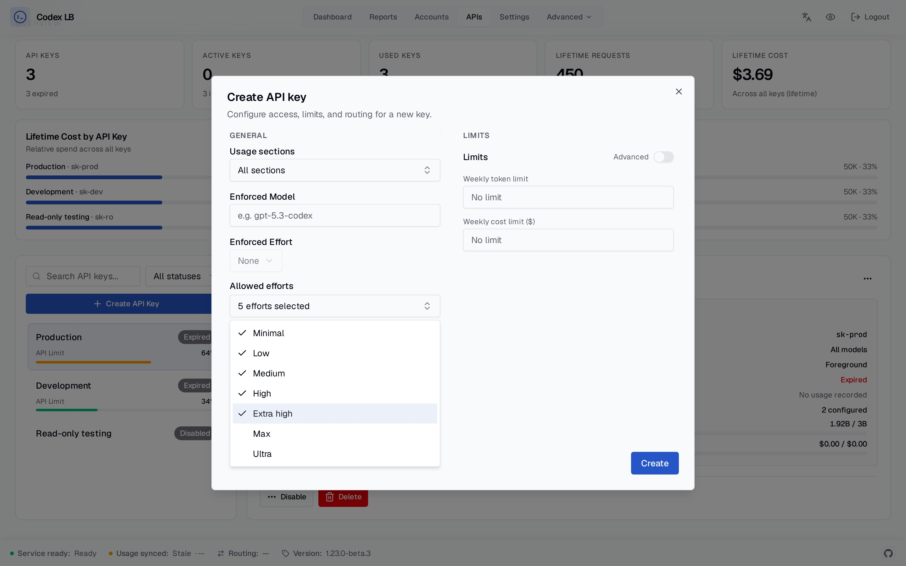

# API Key Authentication

API key auth is **disabled by default**. In that mode, only local requests to the protected proxy routes can
proceed without a key; non-local requests are rejected until proxy authentication is configured. Enable it in
**Settings → API Key Auth** on the dashboard when clients connect remotely or through Docker, VM, or container
networking that appears non-local to the service.

When enabled, clients must pass a valid API key as a Bearer token:

```
Authorization: Bearer sk-clb-...
```

## Protected routes

The protected proxy routes covered by this setting are:

- `/v1/*` (except `/v1/usage`, which always requires a valid key)
- `/backend-api/codex/*`
- `/backend-api/transcribe`

## Creating keys

Dashboard → API Keys → Create. The full key is shown **only once** at creation. Keys support optional expiration, model restrictions, and rate limits (tokens / cost per day / week / month).

Keys can also be scoped to specific accounts, so a key draws quota only from the accounts assigned to it:



## Self-service key dashboard

Open `/key-dashboard` and enter an active API key to view that key's name and masked prefix, lifecycle and policy details, configured usage limits, lifetime request/token/cost totals, and latest request logs. This page does not require the administrator dashboard password.

The **Group keys** tab compares usage across keys in the same usage group over the last 30 days. Administrators assign a group in the **Usage group** field when creating or editing an API key. Use the same group name on each member; names are case-sensitive and surrounding spaces are trimmed. Leave the field blank to remove a key from sharing. Existing keys start without a group.

For example, assign Alice's and Bob's keys to `Team A`. Either key can then see both members' names, masked prefixes, request counts, total tokens, cached tokens, and costs, including usage before they joined. Group totals include the current key and inactive or expired members' historical usage. Members cannot see each other's credentials, request details, limits, or backing accounts. Removed or reassigned members disappear on the next refresh.

Below the group totals, the daily usage chart plots each member's UTC token or USD cost totals for the rolling 30-day window. Use the Tokens/Cost selector, hide or show individual keys, hover a line for exact values, or expand **View daily data** for an accessible table. The first and last UTC calendar days can be partial because the API window is rolling; days with no usage remain visible as zero.

The period is the preceding 30 days at refresh time. Statistics use retained hourly aggregates plus recent logs and exclude internal warmup traffic. If raw-log retention has already removed a partial hour at the window boundary, that partial hour cannot be recovered precisely from hourly aggregates.

The key is sent only as a Bearer header and stays in the current tab's memory by default. Enable **Remember on this browser** to store it in browser-local storage after successful authentication; use this only on a trusted device. Disconnecting or an invalid-key response removes the stored credential. The page intentionally omits the raw key, key database ID/hash, account/source assignments, pooled account data, client metadata, conversation/archive identifiers, routing identifiers, and detailed failure text.

## Reasoning effort policies

A key can either enforce one reasoning effort or allow a selected non-empty set of client-requested efforts.
Leave the allowed-efforts selection empty to keep the existing unrestricted behavior. A request that explicitly
sets an effort outside its key's allowlist receives a `403 reasoning_effort_not_allowed` response. Requests that
omit a reasoning effort continue to use the model or upstream default.

The policy evaluates the effort selected by the client, including supported model aliases such as `-xhigh`.
Each configured effort is distinct: allowing `high` does not allow `xhigh`, and allowing `max` does not allow
`ultra`. The proxy still rewrites an allowed `ultra` request to the upstream wire value `max`.



For wiring keys into each client, see [Client Setup](client-setup.md).

---

*Specs: [api-keys](https://github.com/Soju06/codex-lb/tree/main/openspec/specs/api-keys) · [api-key-dashboard](https://github.com/Soju06/codex-lb/tree/main/openspec/specs/api-key-dashboard)*
