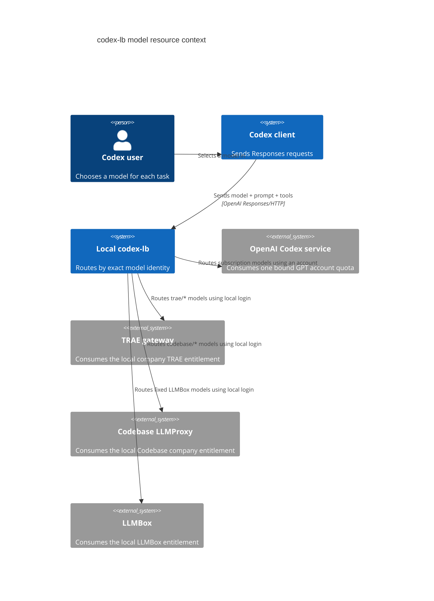
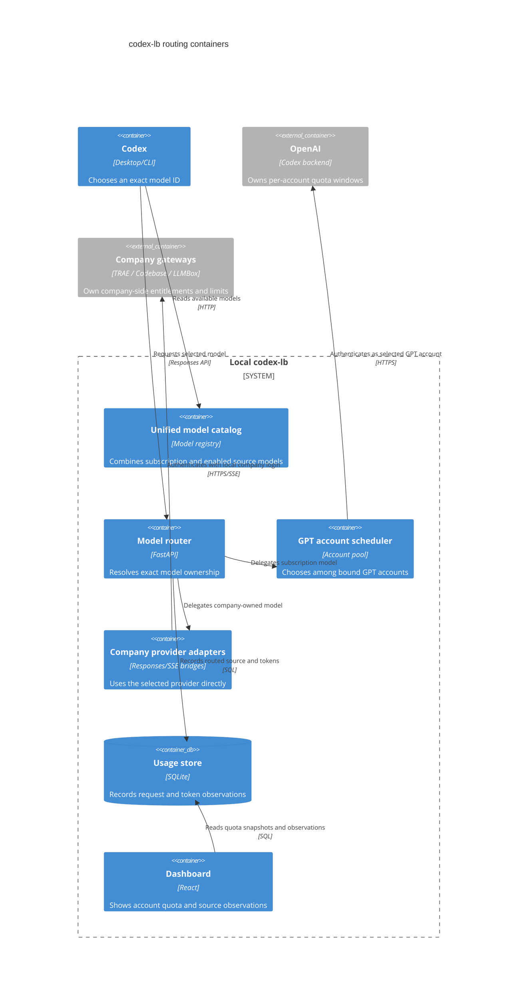
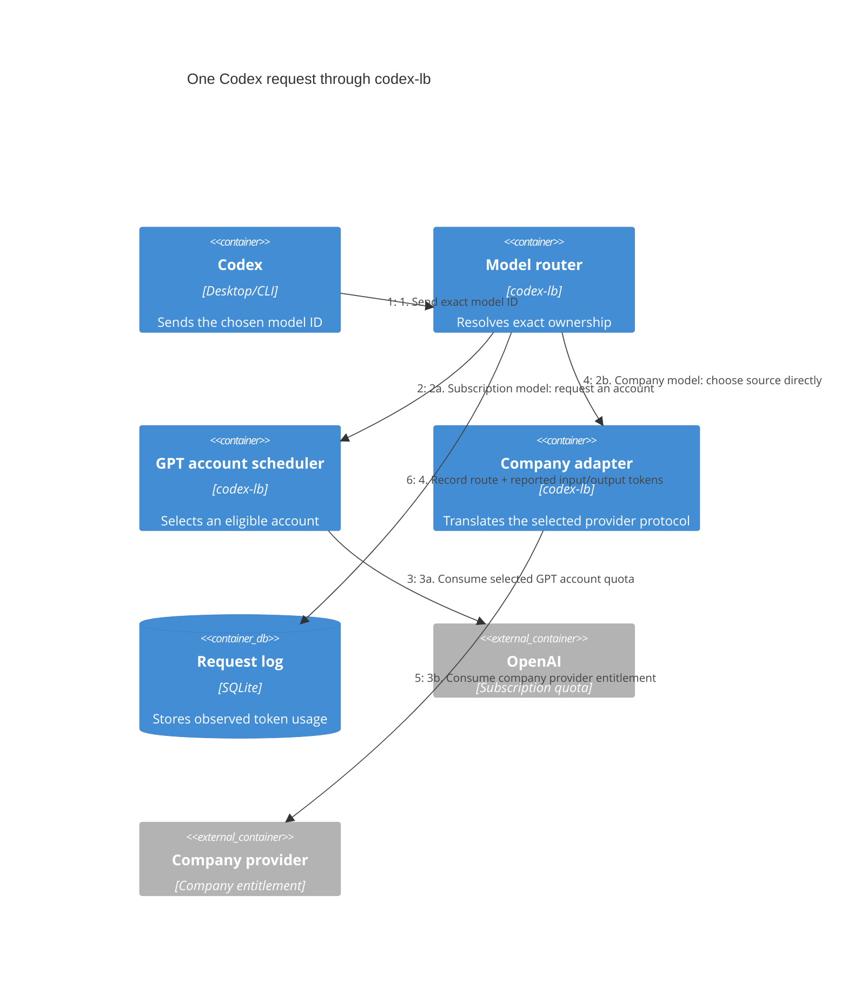

# Company model routing and token accounting

This page explains how subscription-backed GPT models and company model
providers coexist behind one codex-lb endpoint. Normative routing behavior is
owned by [model-source-routing](../../openspec/specs/model-source-routing/spec.md).

## System context

## Containers and resource ownership

## Request flow

The two branches do not share quota. Examples:

| Selected model | codex-lb route | Credential/resource consumed |
| --- | --- | --- |
| `gpt-5.4` | GPT account scheduler | One eligible bound OpenAI account |
| `trae/GPT-6-Astra` | TRAE adapter | Local TRAE company login |
| `codebase/kimi-k2.6` | Codebase Chat adapter | Local Codebase-backed TRAE login |
| `codebase/gpt-5.4` | Codebase Responses adapter | Local Codebase-backed TRAE login |
| `deepseek-v4-flash-0731` | LLMBox adapter | Local LLMBox login |

For bound OpenAI accounts, codex-lb can display upstream quota windows and use
them during account selection. The company gateways currently expose no
validated remaining-quota contract. Their dashboard cards therefore show
remaining quota and reset time as `unknown`, while separately showing the
input/output tokens reported by completed requests during the retained 24-hour
window. These observations measure traffic; they are not a company quota
balance.

Provider errors do not silently move a company model request into the GPT
account pool. Source namespacing (`trae/*` and `codebase/*`) makes ownership
explicit and prevents same-name GPT models from colliding with subscription
models.

## Company operational controls

The production implementation adds a company admission layer before forwarding:
observed health and cooldown, then a rolling 24-hour local token budget, then
the existing Responses concurrency control. A two-hour scheduler probes each
enabled company model and hides models whose last probe failed, exceeded the
latency threshold, or became stale. A 429 or credential failure triggers a
60-second cooldown, as do three consecutive qualifying server/transport
failures. Client cancellations and ordinary validation errors do not make the
source unhealthy. After cooldown, the next request can establish recovery; a
successful response restores healthy status.

The optional local budget defaults to unlimited. It rejects new requests once
reported input plus output tokens reach the configured limit. This is a soft
limit: missing upstream usage and concurrent in-flight requests can exceed it.
The dashboard exposes these limitations alongside successes, errors and latency.
The contract is part of [model-source-routing](../../openspec/specs/model-source-routing/spec.md); production evidence is in [company source governance verification](../../openspec/changes/archive/2026-09-10-add-company-source-governance/verification.md).

Local macOS upgrades can use `scripts/local_launchagent_cutover.py`. The
one-shot harness rejects execution as a KeepAlive LaunchAgent, validates the
candidate executable before stopping the current service, allows a bounded
startup window, and restores the saved plist when bootstrap or health checks
fail. Its unit tests cover delayed startup, bootstrap failure, health timeout,
rollback verification, and the KeepAlive regression.
