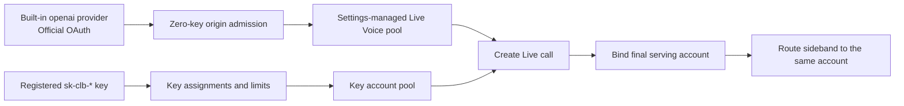

# Codex Live Voice

codex-lb keeps Live Voice call creation and its control sideband on the same upstream ChatGPT account. This preserves call ownership when several upstream accounts share one pool.

!!! note "Private Codex compatibility"
    This capability covers the private routes used by Codex. WebRTC media remains peer-to-peer.

## How it works



The OAuth and registered-Key lanes share call ownership handling. Their admission rules and account pools remain independent.

## Caller authentication

The same private routes accept two caller types:

- Registered [proxy API keys](api-keys.md) keep their existing account assignments, limits, attribution, and affinity behavior.
- Official Codex OAuth credentials use the global policy under **Settings → Live Voice** after passing the ordinary zero-key proxy origin check.

The OAuth lane is available when global proxy API-key authentication is disabled and the request comes from loopback or an existing explicitly allowed raw socket CIDR. Loopback needs no CIDR configuration. Other remote clients use registered Proxy API Keys.

codex-lb derives an opaque caller scope locally from the bearer and normalized `chatgpt-account-id`. It does not call OpenAI usage to authenticate Live requests. The network boundary grants keyless access; the credential pair separates call ownership between admitted clients.

## Configure the OAuth Live pool

1. Import the upstream ChatGPT Accounts that may carry Live calls.
2. Open **Settings → Live Voice**.
3. Select the allowed upstream Accounts.
4. Enable **OAuth Live access** and save.

The global policy starts disabled with an empty pool. Enabling it requires at least one Account. Runtime routing uses only Accounts that remain active. A selected Account that later becomes paused, deactivated, or requires reauthentication stays visible in the selector so it can be removed.

This policy controls the OAuth lane only. Registered Proxy API Keys continue using their own assignments and limits.

## Built-in OpenAI provider (OAuth)

Use this profile when Codex must retain the built-in `openai` provider. It keeps official ChatGPT OAuth for conversations and Live Voice and requires no Codex-LB API Key in the client.

Enable **Settings → Live Voice → OAuth Live access**, select the upstream Accounts allowed to carry these calls, keep global proxy API-key authentication disabled, and route both Live Voice legs to codex-lb:

```toml
model_provider = "openai"
experimental_realtime_webrtc_call_base_url = "http://127.0.0.1:2455/backend-api/codex"
experimental_realtime_ws_base_url = "http://127.0.0.1:2455/v1"
```

## Registered Proxy API Key

Use this existing profile when the client should follow one registered Key's assignments, limits, and attribution. `requires_openai_auth = true` keeps the Codex app's ChatGPT account capabilities and Live Voice entry visible. `env_key` supplies the Codex-LB bearer used by conversations and Live routes.

```toml
model_provider = "codex-lb"
experimental_realtime_webrtc_call_base_url = "http://127.0.0.1:2455/backend-api/codex"
experimental_realtime_ws_base_url = "http://127.0.0.1:2455/v1"

[model_providers.codex-lb]
name = "openai"
base_url = "http://127.0.0.1:2455/backend-api/codex"
wire_api = "responses"
env_key = "CODEX_LB_API_KEY"
supports_websockets = true
requires_openai_auth = true
```

```bash
export CODEX_LB_API_KEY="sk-clb-..."
```

This profile uses the registered-Key lane and remains independent from the OAuth Live policy on the Settings page.

## Client route compatibility

The current client appends `/realtime/calls` to the WebRTC base and `/realtime?intent=...&call_id=...` to the WebSocket base. Repeat a real route probe after each bundled Codex upgrade because these keys remain experimental.

## Supported private routes

- `POST /backend-api/codex/realtime/calls`
- `WS /backend-api/codex/{call_id}`
- `WS /v1/live/{call_id}`
- `WS /v1/realtime?call_id={call_id}`

After call creation succeeds, codex-lb binds the returned call id to the final serving account under the caller scope. Every sideband form recomputes that scope, reloads the exact owner, and confirms the current policy still allows it.

OAuth bearer rotation or encryption-key rotation changes the caller scope. A sideband using changed credentials receives the credential-safe not-found response and the client creates a new call.

## Privacy and request history

Ownership records contain a caller-scoped digest and the owning account reference. Credentials, account headers, raw call ids, SDP, attestation values, realtime frames, audio, and transcripts stay out of persistence and request payload traces. OAuth Live request logs use nullable API-key attribution.

## Failure behavior

- `401 invalid_api_key`: caller authentication or zero-key origin admission failed.
- `403 oauth_live_not_enabled`: the global OAuth Live policy is inactive or has no active eligible account.
- `400 invalid_realtime_call_id`: the sideband supplied an invalid call id.
- `404 realtime_call_not_found`: ownership is missing or the credential pair changed.
- `503 realtime_call_binding_failed`: a successful upstream call could not be bound safely.

For client-side symptoms and route checks, see [Troubleshooting](troubleshooting.md#live-voice).

*Specs: [realtime-api-compat](https://github.com/Soju06/codex-lb/tree/main/openspec/specs/realtime-api-compat) · [database-migrations](https://github.com/Soju06/codex-lb/tree/main/openspec/specs/database-migrations) · [frontend-architecture](https://github.com/Soju06/codex-lb/tree/main/openspec/specs/frontend-architecture)*
